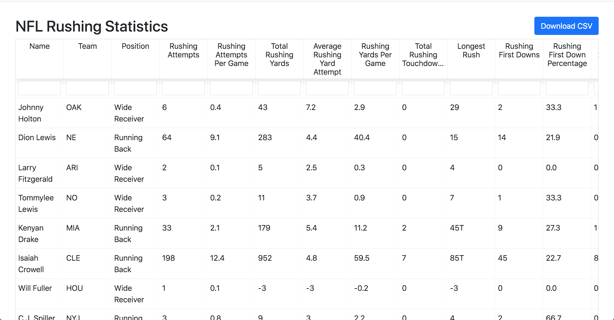

# theScore "the Rush" Interview Challenge

At theScore, we are always looking for intelligent, resourceful, full-stack developers to join our growing team. To help us evaluate new talent, we have created this take-home interview question. This question should take you no more than a few hours.

**All candidates must complete this before the possibility of an in-person interview. During the in-person interview, your submitted project will be used as the base for further extensions.**

### Why a take-home challenge?

In-person coding interviews can be stressful and can hide some people's full potential. A take-home gives you a chance work in a less stressful environment and showcase your talent.

We want you to be at your best and most comfortable.

### A bit about our tech stack

As outlined in our job description, you will come across technologies which include a server-side web framework (like Elixir/Phoenix, Ruby on Rails or a modern Javascript framework) and a front-end Javascript framework (like ReactJS)

### Challenge Background

We have sets of records representing football players' rushing statistics. All records have the following attributes:

-   `Player` (Player's name)
-   `Team` (Player's team abbreviation)
-   `Pos` (Player's postion)
-   `Att/G` (Rushing Attempts Per Game Average)
-   `Att` (Rushing Attempts)
-   `Yds` (Total Rushing Yards)
-   `Avg` (Rushing Average Yards Per Attempt)
-   `Yds/G` (Rushing Yards Per Game)
-   `TD` (Total Rushing Touchdowns)
-   `Lng` (Longest Rush -- a `T` represents a touchdown occurred)
-   `1st` (Rushing First Downs)
-   `1st%` (Rushing First Down Percentage)
-   `20+` (Rushing 20+ Yards Each)
-   `40+` (Rushing 40+ Yards Each)
-   `FUM` (Rushing Fumbles)

In this repo is a sample data file [`rushing.json`](/rushing.json).

##### Challenge Requirements

1. Create a web app. This must be able to do the following steps
    1. Create a webpage which displays a table with the contents of [`rushing.json`](/rushing.json)
    2. The user should be able to sort the players by _Total Rushing Yards_, _Longest Rush_ and _Total Rushing Touchdowns_
    3. The user should be able to filter by the player's name
    4. The user should be able to download the sorted data as a CSV, as well as a filtered subset
2. The system should be able to potentially support larger sets of data on the order of 10k records.

3. Update the section `Installation and running this solution` in the README file explaining how to run your code

### Submitting a solution

1. Download this repo
2. Complete the problem outlined in the `Requirements` section
3. In your personal public GitHub repo, create a new public repo with this implementation
4. Provide this link to your contact at theScore

We will evaluate you on your ability to solve the problem defined in the requirements section as well as your choice of frameworks, and general coding style.

### Help

If you have any questions regarding requirements, do not hesitate to email your contact at theScore for clarification.

## Installation and running this solution :football:

<p align='center'></p>

#### System Requirements

-   Ruby version 2.4.2 - If using rvm run `rvm use 2.4.2`
-   Yarn Installed - `npm install --global yarn`
-   Node >=v10.17.0 - If using nvm run `nvm install 10.17.0`
    OR use npm as outlined in [this article](https://medium.com/@tungtran91/upgrading-node-js-to-latest-version-how-to-update-node-to-any-version-using-npm-47c97d5ffe30) :)
    OR if on a new Apple M1 look at [this article](https://dev.to/courier/tips-and-tricks-to-setup-your-apple-m1-for-development-547g)

```
$ git clone git@github.com:annajbaron/nfl-rushing.git
$ cd nfl-rushing
$ bundle install
$ yarn install --check-files
$ rake db:create
$ rake db:migrate
$ rake db:seed
$ rails s
```

-   Navigate to `http://localhost:3000`

#### Running the test suite

`yarn test`

### FUTURE IMPROVMENTS:

-   Refactor to have a global search bar which queries all columns at once
-   Add more tests to models and react components
-   Enable the user to customize the CSV download to specify which columns to include
-   Add visuals i.e. pictures for all players or team logos
